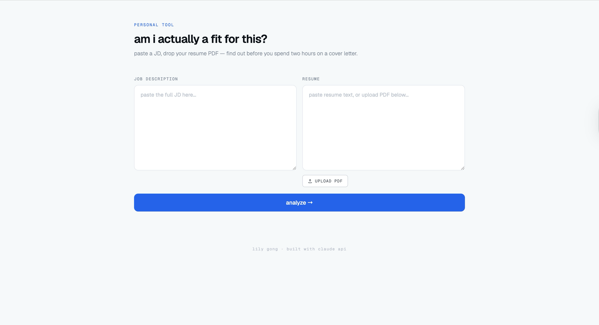
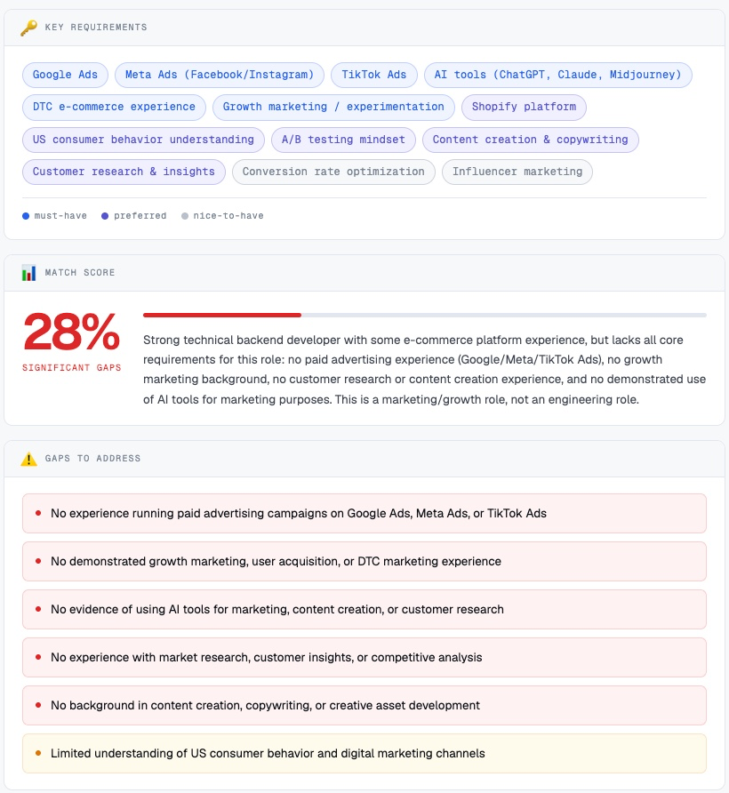
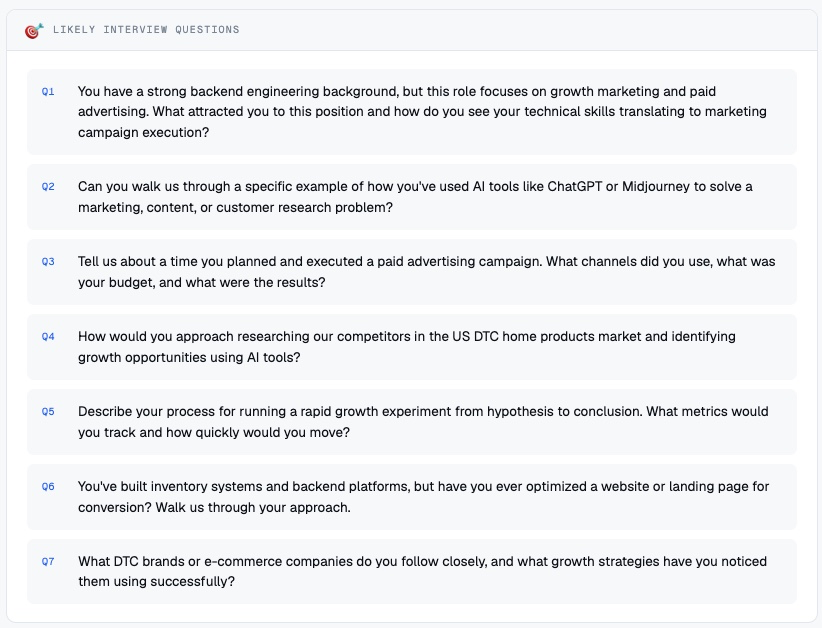

# Job Fit Analyzer

A personal tool that analyzes how well your resume matches a job description — before you spend time applying.

## Preview

  
  

## What it does

Paste a JD and your resume (or upload a PDF), and get:

- **Match score** — honest 0-100 rating with explanation
- **Key requirements** — must-haves, preferred, and nice-to-haves extracted from the JD
- **Skill gaps** — critical missing requirements and minor gaps to address
- **Interview questions** — likely questions based on the specific role

## Tech

- Vanilla HTML/CSS/JS (single file frontend)
- Vercel serverless function as API proxy
- Anthropic Claude API (claude-sonnet-4-5)
- PDF.js for resume PDF parsing

## Built with

This tool was built with the help of Claude.

## Setup

1. Clone the repo
2. Deploy to Vercel
3. Add `ANTHROPIC_API_KEY` in Vercel Environment Variables
4. Redeploy
